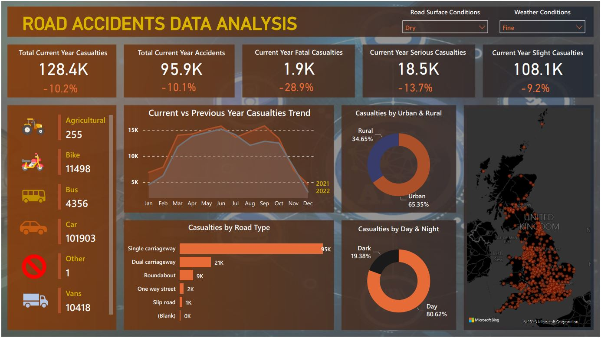
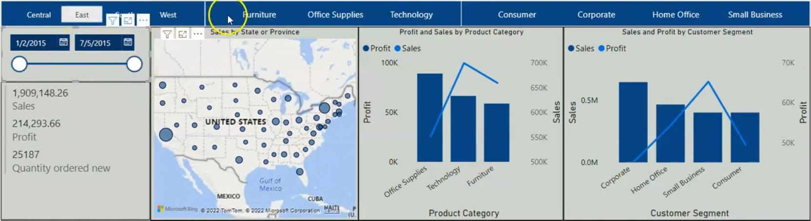
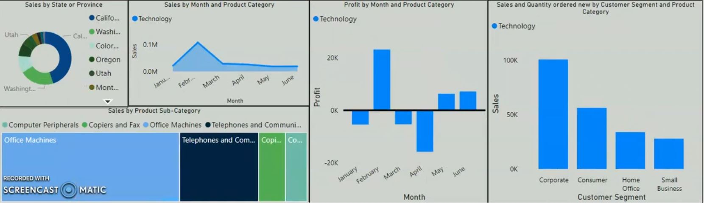

# [Project 1: Road Accident Data Analysis - Power BI](https://github.com/seidumohammed/data-analysis/tree/main/power_bi-road-accident-data-analysis)
  ## Requirements
     Client wants to create dashboard for road aciddents from 2021 - 2022 
  1. Primary KPI - total casualties & total accident values for latest year and YoY growth
  2. Primary KPI's - total casualties by accident severity for latest year and YoY growth
  3. Secondary KPI's -  Total casualties with respect to type of vehicle for latest year
  4. Monthly trend shwoing comparison of casualties for latest year and previous year
  5. Casualties by road type for latest year
  6. Latest year road casualties by location and time(day/night)
  7. Total casualties and total accident by location

#### Project Description
Data Analysis of road accidents dataset from 2021 - 2022 
---
Project Link: [Repository](https://github.com/seidumohammed/data-analysis/tree/main/power_bi-road-accident-data-analysis)
---
---

---
---
  
# 1. Sales Data Analysis With Excel Using Pivot Tables And Advanced Formulas

#### Project Description 

Project Link: [Repository](https://github.com/seidumohammed/data-analysis/tree/main/excel-dynamic-data-analysis_pivot_table)
---

---

# 2. Sales Data Analysis With Microsoft Power BI

#### Project Description

Project Link: [Repository](https://github.com/seidumohammed/data-analysis/tree/main/power_bi-dynami-data-analysis-dashboard)
---

---

---